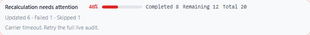

# PS-438 — Rate Recalculation Job Progress

Trello: https://trello.com/c/yQE5XmC4

## Source-of-Truth Placement

- `src/services/rates-backfill.ts` remains the canonical owner of job status and the `total`, `processed`, `updated`, `skipped`, and `failed` counters.
- `/rates/backfill-best/status/:jobId` and `/rates/backfill-best/latest` remain the transport boundary. No backend rate-selection, persistence, carrier, cache, billing, label, or shipment rule changed.
- The frontend projection computes only presentation values: `remaining = max(total - processed, 0)` and a display percentage. It reserves 100% for a backend `done` snapshot whose processed count reached the backend total.

## Imperfect-Data Injection Fixed

The existing poller received the full backend snapshot but immediately collapsed it into a short text summary. That discarded the structured counters before the toolbar could render useful progress. The UI now retains the last backend snapshot and passes it through one pure display projection shared by Recalculate All and Recalculate Selected.

The latest-job response already includes the durable generation request source. Refresh reattachment now uses that backend metadata: only `requestedBy: manual` restores visible operator progress. Cadence, ingest, and targeted-order-change jobs may still refresh rows, but cannot impersonate an operator click.

## Rendered States

### Preparing / unknown total

### Partial progress

### Completed

### Interrupted / error

## Verification

- `npm run test:ps-438-rate-recalculation-progress`
- `npm run test:ps-438-rate-recalculation-progress:browser`
- `npm run test:recalculate-all-job-coordination`
- `npm run test:ps-345-rate-loading-sot`
- `npm run test:rate-source-of-truth`
- `npm run typecheck`
- `npm run build:web`

The browser suite mocks every request. No live carrier calls, label purchase, postage spend, marketplace notification, or production order/shipment mutation occurs.
